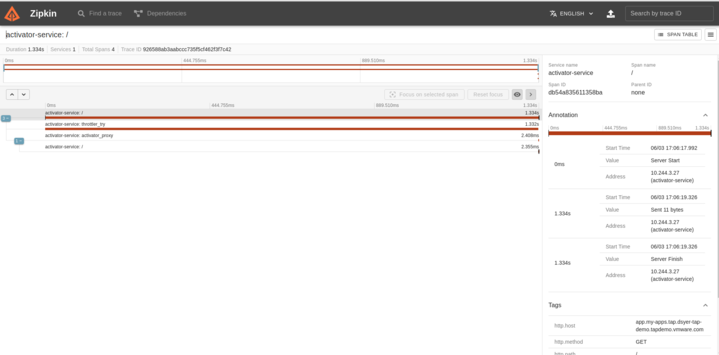

Total time for client to receive response is measured like this:

```
$ curl -o /dev/null -H 'Cache-Control: no-cache' -s -w "Connect: %{time_connect} TTFB: %{time_starttransfer} Total time: %{time_total} \n" app.my-apps.tap.dsyer-tap-demo.tapdemo.vmware.com
Connect: 0.131538 TTFB: 1.341332 Total time: 1.341452
```

The time to first byte (TTFB) is about 1300ms. Fluctuates by up to 200ms if you try it a few times. With a warm service TTFB is about 180ms, so that's the "normal" latency, mostly consisting of network 
travel time to abd from Azure servers (estimated 160ms based on ping times).

Here's what we can learn from the logs with `logging.level.org.springframework.web=trace`:

| Time(ms)  | Activity |
| ------------- | ------------- |
| 180  | Cluster response time for warm service |
| 80   | Application startup |
| 660  | Waiting for first request to `/readyz` |
| 30   | Delay between `/readyz` and queued request to `/` |
| 390  | General pod scheduling and container startup |

* 390ms for scheduling and container startup seems pretty fast. I'm sure there are ways to attack it, but it's not a bad start.
* 660ms waiting for the first request to `/readyz` is a bit long. I'm not sure why it's so long, because as far as we know the autoscaler polls every 200ms.
* 

* TAP Notes

Install Zipkin:

```
$ kubectl apply -f config/zipkin.yaml
```

Pause the package install for TAP in the `kapp-controller` (or you could just `kubectl edit` those changes instead):

```
kubectl patch -n tap-install pkgi tap --type=merge -p '{"spec":{"paused":true}}'
kubectl patch -n tap-install pkgi cnrs --type=merge -p '{"spec":{"paused":true}}'
```

Update the tracing configuration in `knative-serving`:

```
$ kubectl apply -f config/tracing.yaml
```

Go to the Zipkin UI and browse for traces. Here's an example of a trace for a request to the application when it needs a cold start:



That's actually the only trace when activating my app (scaling up from 0 to 1) and scaling back down to 0. It doesn't tell us much, except that the activator-service agrees with us that it takes 1.3s. There's no detail in the "throttler_try" span (which is the long one). It's just a single event with no details.

Kubelet logs:

```
$ for f in `kubectl get nodes -o custom-columns=:.metadata.name`; do kubectl get --raw "/api/v1/nodes/$f/proxy/logs/messages" | grep kubelet; done
```

| Kubelet Event | Timeline(ms) | Delta(ms)  | Node Event | Application Event |
| -- |------- | ------ | ------------- | ------------- |
| 0  |   0 |     | SyncLoop ADD | 
| 1  |   0 |   0 | RemoveStaleState removing state | 
| 2  |  65 |  65 | operationExecutor.VerifyControllerAttachedVolume started for volume |
| 3  | 165 | 100 | operationExecutor.MountVolume started for volume |
| 4  | 190 |  25 | MountVolume.SetUp succeeded for volume |
| 5  | 320 | 130 | No sandbox for pod can be found. Need to start a new one |
|5.0 | 321 |   1 | containerd: RunPodSandbox |
|5.1 |     |     | systemd-networkd: Link UP |
|5.2 | 396 |  75 | kernel: cbr0: port entered blocking state
|    |     |     | systemd-networkd: Gained carrier |
|5.3 |     |     | kernel: eth0: link becomes ready
|5.4 | 396 |   0 | containerd: loading plugin |
|5.5 | 476 |  80 | containerd: RunPodSandbox |
|5.6 | 476 |   0 | containerd: CreateContainer (workload) |
|5.7 | 506 |  30 | containerd: StartContainer |
|    | 565 |     |                                 | Process starts (extrapolated back)|
|5.8 | 556 |  50 | containerd: StartContainer |
|5.9 | 556 |   0 | containerd: CreateContainer (queue-proxy) |
|5.10| 596 |  40 | containerd: StartContainer |
|    | 640 |     |                                 | Starting AOT-processed DemoApplication |
|    | 725 |     |                                 | Started DemoApplication in 0.153 seconds (process running for 0.157) |
| 6  | 730 | 135 | Type:ContainerStarted |
| 7  | 730 |   0 | Type:ContainerStarted |
|7.1 | 740 |  10 | containerd: StartContainer |
| 8  |1730 | 990 | Type:ContainerStarted |
|    |1740 |     |                                 | First request to /readyz |
| 9  |1740 |  10 | probe="readiness" status="" |
|10  |1744 |   4 | probe="readiness" status="ready" |

The application starts in between #5 and #6, and it reports that it has started after 157ms (before event #6). The total time to first byte from the client in this case was longer (2100ms), which is roughly consistent with the Kubelet timeline.

I tried it a couple of times and always see those 3 `ContainerStarted` events, but sometimes they come at the same time instead of being staggered a bit like this example. In that case there is still a delay of 900-1000ms between event #5 and #8.